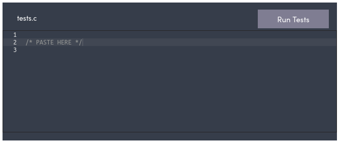

# VarsityCode test cases

This is a repository that contains the test cases for all the closed challenges in VarsityCode.

Inside each challenge folder, you'll find a file for every programming language. To check your code against the test cases, copy the contents of the relevant file and paste it into the `tests` box on the challenge webpage. Then click on `Run Tests` to, well... run the tests.

Note that you'll need to write out your code again in the `solution` box.

#### Disclaimer

I haven't tested the files for every programming language, so if there are any problems send me a message, `@Xoaquin Castrelo` on the Showcode Discord server, and I'll try and fix it.

